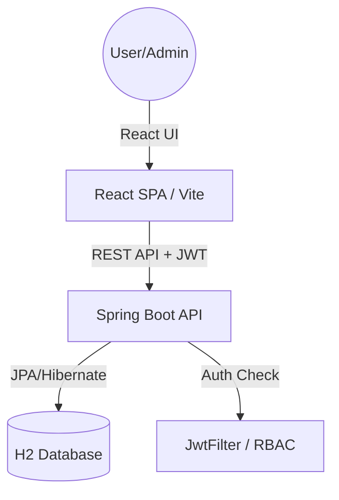

# Design Document - Product Admin System

## 1. Project Overview
The Product Admin system is a simplified full-stack application designed to manage a product catalog. It differentiates between administrative users (with full CRUD access) and regular users (view-only).

## 2. Architecture
The application follows a standard client-server architecture:
- **Frontend**: A single-page application (SPA) built with React and Vite. It uses `fetch` for API communication and manages UI state locally.
- **Backend**: A Spring Boot application providing RESTful APIs. It handles business logic, security authentication, and data persistence.
- **Database**: H2 embedded database using file-based persistence for development simplicity.

## 3. Technology Stack
| Layer | Technology |
| :--- | :--- |
| **Frontend** | React 18, Vite, Vanilla CSS |
| **Backend** | Spring Boot 3.3.5, Maven, Java 17 |
| **Database** | H2 (File persistence), Spring Data JPA |
| **Security** | JWT (JSON Web Tokens), `io.jsonwebtoken` |

## 4. Security Model - JWT & RBAC
Authentication is stateless and uses JWTs stored in the browser's `localStorage`.

### JwtFilter
The custom `OncePerRequestFilter` intercepts incoming requests (except `/auth` and `/h2-console`) to:
1.  Extract the Bearer token from the `Authorization` header.
2.  Validate the token using `JwtUtil`.
3.  Extract the `user` and `role` claims.
4.  Inject the `role` attribute into the request for controller-level access control.

### RBAC Hierarchy
- **ADMIN**: Access to GET, POST, PUT, DELETE endpoints. UI renders management forms and action buttons.
- **USER**: Access to GET endpoints only. UI renders a read-only catalog.

## 5. Data Model
### Product Entity
The system manages a single entity, `Product`:
- `id`: Long (Primary Key, Auto-generated)
- `name`: String (Product Name)
- `price`: Double (Product Price)
- `imageUrl`: String (URL for external images)

### Persistence Strategy
- **Seeding**: Data is automatically populated at startup via `src/main/resources/data.sql`.
- **File Database**: Data is saved to `./data/productdb`, ensuring persistence across application restarts.

## 6. API Endpoints
### Authentication
- `POST /auth/login`: Accepts credentials and returns a JWT token if valid.

### Products
- `GET /products`: returns all products (Public/Authorized).
- `POST /products`: creates a new product (ADMIN only).
- `PUT /products/{id}`: updates an existing product (ADMIN only).
- `DELETE /products/{id}`: removes a product (ADMIN only).

---
*Created on 2026-04-06*
